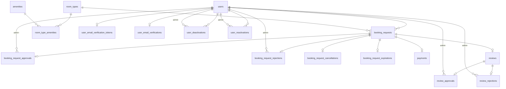
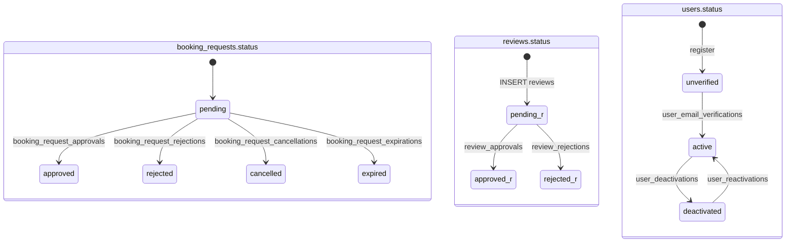

# Database Design

> Related: [Function list](../../02_requirements/function-list.md) ·
> [Non-functional requirements](../../02_requirements/non-function-list.md) ·
> [Glossary](../../02_requirements/glossary.md) · [API list](./api-design/api-list.md) ·
> ERD draw.io: [database-erd.drawio](./database-erd.drawio)
>
> Postgres 17 + TypeORM. Heading, tên bảng, tên cột, giá trị enum giữ tiếng Anh vì xuất hiện nguyên
> văn trong code; diễn giải bằng tiếng Việt.

> **Status: DRAFT — thiết kế dự kiến, chưa có code xác nhận.** Các quyết định ở đây là INFERRED từ
> requirement. Khi implement thấy không hợp lý: nêu mâu thuẫn, quyết xong ghi vào `## Deviations` rồi sửa phần chính.

## 1. Overview

Schema gồm **17 bảng**, chia ba nhóm theo Immutable Data Model:

| Nhóm            | Bảng                                                                                                                                                                            | Tính chất                                           |
| --------------- | ------------------------------------------------------------------------------------------------------------------------------------------------------------------------------- | --------------------------------------------------- |
| Resource        | `users`, `room_types`, `amenities`, `room_type_amenities`, `user_email_verification_tokens`                                                                                     | Sửa được (UPDATE)                                   |
| Long-term event | `booking_requests`, `reviews`                                                                                                                                                   | INSERT lúc tạo; sau đó chỉ cột `status` được UPDATE |
| Outcome / log   | `booking_request_{approvals, rejections, cancellations, expirations}`, `payments`, `review_{approvals, rejections}`, `user_{email_verifications, deactivations, reactivations}` | **Chỉ INSERT**, một timestamp, không cột nullable   |

Nguyên tắc bắt buộc:

- **`status` là projection.** Nó chỉ đổi khi có một dòng mới ở bảng outcome tương ứng, trong cùng
  transaction: `INSERT outcome` + `UPDATE ... SET status = <mới> WHERE id = ? AND status = <hiện tại>`,
  kiểm `rowCount = 1`, không thì rollback. Không có code path nào sửa `status` mà không INSERT outcome.
- **Không cột nullable** trong toàn schema. Thuộc tính chỉ có ở một loại sự kiện thì nằm ở bảng của
  sự kiện đó (ví dụ `reason` chỉ ở `booking_request_rejections`).
- **Enum = `varchar` + `CHECK`**, không dùng enum native của Postgres, để migration `down` chạy được (NFR-006).
- **Quy ước tên**: bảng snake_case số nhiều; `_at` = `timestamptz`, `_date` = `date`; `_id` = FK, thêm
  vai trò khi cần (`admin_user_id`); tiền = `bigint` VND.
- **Đơn vị bán là loại phòng.** Không có bảng phòng vật lý (xem `glossary.md` → Room).

## 2. ERD



Bản đầy đủ cột: `database-erd.drawio` cùng thư mục.

## 3. Table Definitions

Mọi bảng: `id bigint GENERATED ALWAYS AS IDENTITY PRIMARY KEY`, mọi cột `NOT NULL`, `created_at timestamptz DEFAULT now()`. Chỉ ghi các cột còn lại.

### 3.1 Resource

**users**

| Column        | Type         | Constraint                                                          | Note                                                                                    |
| ------------- | ------------ | ------------------------------------------------------------------- | --------------------------------------------------------------------------------------- |
| email         | varchar(255) | unique index trên `lower(email)`                                    |                                                                                         |
| password_hash | varchar(255) |                                                                     | bcrypt (NFR-003)                                                                        |
| full_name     | varchar(100) |                                                                     |                                                                                         |
| role          | varchar(10)  | CHECK IN ('user','admin')                                           | Visitor không phải giá trị DB (role-list §1)                                            |
| status        | varchar(12)  | CHECK IN ('unverified','active','deactivated') DEFAULT 'unverified' | Projection của `user_email_verifications` / `user_deactivations` / `user_reactivations` |
| updated_at    | timestamptz  | DEFAULT now()                                                       |                                                                                         |

**room_types**

| Column          | Type         | Constraint    | Note                  |
| --------------- | ------------ | ------------- | --------------------- |
| name            | varchar(100) | UNIQUE        |                       |
| description     | text         |               |                       |
| price_per_night | bigint       |               | VND; `> 0` kiểm ở app |
| total_rooms     | integer      | CHECK >= 0    | 0 = ngừng bán         |
| updated_at      | timestamptz  | DEFAULT now() |                       |

**amenities**

| Column | Type        | Constraint | Note                                                                                                                                                         |
| ------ | ----------- | ---------- | ------------------------------------------------------------------------------------------------------------------------------------------------------------ |
| code   | varchar(20) | UNIQUE     | Seed 14 dòng: air_conditioning, wifi, tv, minibar, balcony, bathtub, bed_single, bed_double, bed_twin, bed_king, view_sea, view_city, view_garden, view_none |

**room_type_amenities**

| Column       | Type   | Constraint                        | Note                                                              |
| ------------ | ------ | --------------------------------- | ----------------------------------------------------------------- |
| room_type_id | bigint | FK → room_types ON DELETE CASCADE |                                                                   |
| amenity_id   | bigint | FK → amenities                    |                                                                   |
|              |        | UNIQUE (room_type_id, amenity_id) | DB không ép "đúng một bed / một view" — trách nhiệm lúc nhập liệu |

**user_email_verification_tokens**

| Column     | Type        | Constraint                           | Note                                       |
| ---------- | ----------- | ------------------------------------ | ------------------------------------------ |
| user_id    | bigint      | FK → users ON DELETE CASCADE, UNIQUE | Gửi lại mail = thay dòng; xoá sau khi dùng |
| token_hash | varchar(64) |                                      |                                            |
| expires_at | timestamptz |                                      |                                            |

### 3.2 Long-term event

**booking_requests**

| Column          | Type        | Constraint                                                                         | Note                                                               |
| --------------- | ----------- | ---------------------------------------------------------------------------------- | ------------------------------------------------------------------ |
| user_id         | bigint      | FK → users                                                                         |                                                                    |
| room_type_id    | bigint      | FK → room_types                                                                    |                                                                    |
| rooms_requested | integer     | CHECK > 0                                                                          | 1..5 kiểm ở app (F-008 §5.1)                                       |
| check_in_date   | date        |                                                                                    |                                                                    |
| check_out_date  | date        | CHECK (check_out_date > check_in_date)                                             | Nửa mở `[in, out)`; ≤ 30 đêm, không quá khứ, ≤ 12 tháng kiểm ở app |
| total_amount    | bigint      |                                                                                    | VND; chốt lúc tạo, không tính lại (AC-11)                          |
| status          | varchar(10) | CHECK IN ('pending','approved','rejected','cancelled','expired') DEFAULT 'pending' | Projection của 4 bảng outcome                                      |
| expires_at      | timestamptz |                                                                                    | App tính: `min(created_at + 24h, check_in_date 00:00 Asia/Saigon)` |
| updated_at      | timestamptz | DEFAULT now()                                                                      | Cột dư có chủ ý — luôn bằng `created_at` của dòng outcome          |

**reviews**

| Column             | Type        | Constraint                                                   | Note                                                    |
| ------------------ | ----------- | ------------------------------------------------------------ | ------------------------------------------------------- |
| booking_request_id | bigint      | FK → booking_requests, UNIQUE                                | 1 booking = 1 review; loại phòng suy từ booking (F-013) |
| rating             | smallint    | CHECK BETWEEN 1 AND 5                                        |                                                         |
| comment            | text        |                                                              |                                                         |
| status             | varchar(10) | CHECK IN ('pending','approved','rejected') DEFAULT 'pending' | Projection của `review_approvals` / `review_rejections` |
| updated_at         | timestamptz | DEFAULT now()                                                |                                                         |

### 3.3 Outcome / log

| Table                         | Columns (ngoài id, created_at)                 | Constraint                                              | Note                                                                |
| ----------------------------- | ---------------------------------------------- | ------------------------------------------------------- | ------------------------------------------------------------------- |
| booking_request_approvals     | booking_request_id, admin_user_id              | booking_request_id UNIQUE; FK → booking_requests, users |                                                                     |
| booking_request_rejections    | booking_request_id, admin_user_id, reason text | booking_request_id UNIQUE                               | `reason` NOT NULL; không rỗng kiểm ở app                            |
| booking_request_cancellations | booking_request_id                             | UNIQUE                                                  | Không actor — luôn là `booking_requests.user_id`                    |
| booking_request_expirations   | booking_request_id                             | UNIQUE                                                  | Do cron ghi                                                         |
| payments                      | booking_request_id, amount bigint              | booking_request_id UNIQUE                               | Mock: một dòng = đã trả; doanh thu (F-019/F-020) tính trên bảng này |
| review_approvals              | review_id, admin_user_id                       | review_id UNIQUE                                        |                                                                     |
| review_rejections             | review_id, admin_user_id                       | review_id UNIQUE                                        | Sheet không bắt lý do                                               |
| user_email_verifications      | user_id                                        | UNIQUE                                                  | `users.status`: unverified → active                                 |
| user_deactivations            | user_id, admin_user_id                         | —                                                       | Không UNIQUE: khoá/mở nhiều lần. active → deactivated               |
| user_reactivations            | user_id, admin_user_id                         | —                                                       | deactivated → active                                                |

## 4. Indexes

| Index                                                                                                   | Purpose                        | Ref            |
| ------------------------------------------------------------------------------------------------------- | ------------------------------ | -------------- |
| `users (lower(email))` UNIQUE                                                                           | Đăng ký / đăng nhập            | F-001, F-002   |
| `users (status)`                                                                                        | Lọc admin, JwtStrategy         | F-004          |
| `booking_requests (user_id, created_at DESC)`                                                           | Lịch sử của user               | F-009          |
| `booking_requests (room_type_id)`                                                                       | FK                             |                |
| `booking_requests (room_type_id, check_in_date, check_out_date) WHERE status IN ('pending','approved')` | Đếm capacity theo ngày         | F-006, NFR-005 |
| `booking_requests (expires_at) WHERE status = 'pending'`                                                | Cron hết hạn hold              | F-008 E-4      |
| `booking_requests (created_at)`                                                                         | Thống kê theo tháng / quý      | F-018          |
| `reviews (status) WHERE status = 'pending'`                                                             | Hàng đợi duyệt                 | F-014          |
| `payments (created_at)`                                                                                 | Doanh thu theo kỳ              | F-019, F-020   |
| `user_deactivations (user_id)`, `user_reactivations (user_id)`                                          | Lịch sử một user               | F-004          |
| `admin_user_id` trên 6 bảng có admin                                                                    | FK                             |                |
| `*_id` UNIQUE trên mọi bảng outcome                                                                     | Tối đa một dòng, kiêm index FK |                |

## 5. State Transitions



Giao thức chung cho mọi mũi tên (tầng service, không dùng trigger):

```sql
BEGIN;
INSERT INTO <outcome_table> (...) VALUES (...);
UPDATE <parent> SET status = '<new>' WHERE id = $1 AND status = '<expected>';
-- rowCount = 1 → COMMIT; = 0 → ROLLBACK (409: trạng thái đã đổi bởi người khác)
```

Riêng tạo booking (F-008): trong cùng transaction, khoá theo `room_type_id`, đếm `SUM(rooms_requested)`
của request `pending`/`approved` **từng ngày** trong `[check_in_date, check_out_date)`, so với `total_rooms`,
rồi mới INSERT. Cơ chế chặn ở tầng DB cho NFR-005 (trigger hay bảng đếm theo ngày) **chưa chốt** — xem §7.

## 6. Design Decisions

| Decision                                                                           | Rationale                                                                                                                                                                         |
| ---------------------------------------------------------------------------------- | --------------------------------------------------------------------------------------------------------------------------------------------------------------------------------- |
| Bốn bảng outcome thay vì một bảng `events`                                         | Mỗi kết cục có cột khác nhau (`reason`, `admin_user_id`); gộp một bảng thì hai cột đó NULL ở phần lớn dòng. Tách ra: không nullable, `UNIQUE` mỗi bảng tự ép "tối đa một kết cục" |
| `status` trên bảng cha dù dựng lại được từ outcome                                 | Đọc một cột cho list / guard / capacity; mọi nguồn IDM trong RDBMS đều làm hybrid này                                                                                             |
| Không `updated_at` trên bảng outcome; có trên `booking_requests`                   | Outcome một timestamp. `booking_requests.updated_at` là dư có chủ ý, tiện cho `@UpdateDateColumn`                                                                                 |
| Không event "created"                                                              | `created_at` của bảng cha đã là sự kiện tạo                                                                                                                                       |
| `_cancellations`, `_expirations` không có actor                                    | Suy ra được: chủ request / hệ thống                                                                                                                                               |
| `total_amount` lưu dù tính được                                                    | AC-11: đổi giá sau không đổi request                                                                                                                                              |
| `expires_at` tính ở app, không generated column                                    | Cast date → timestamptz phụ thuộc múi giờ; giữ `Asia/Saigon` ở config                                                                                                             |
| Amenity: một bảng master + một junction, bed/view gộp chung, không ép đúng-một     | Một cơ chế lọc cho mọi tiêu chí; danh mục cố định nên không cần `name`; đúng-một là trách nhiệm nhập liệu                                                                         |
| Token kích hoạt ở bảng riêng                                                       | Sau kích hoạt cột token/hạn sẽ NULL nếu để trên `users`                                                                                                                           |
| `user_deactivations` / `user_reactivations` là log, không UNIQUE                   | Khoá / mở lặp nhiều lần; cờ `is_active` không nói ai và lúc nào                                                                                                                   |
| `reviews` FK vào booking, không vào room_type                                      | "Chỉ review cái mình đã ở" thành ràng buộc cấu trúc                                                                                                                               |
| `payments` một bảng, một dòng một booking                                          | Mock, không cổng thật, không đường hoàn tiền (không huỷ được request đã duyệt). Mở rộng sau: `status`, `provider`, `payment_failures`, `refunds`                                  |
| Doanh thu tính trên `payments`, không trên `total_amount`                          | Tiền đã thu ≠ giá đã chốt                                                                                                                                                         |
| Rule chính sách (1..5 phòng, ≤30 đêm, ≤12 tháng, giá > 0, reason không rỗng) ở app | Là số có thể đổi; DB chỉ giữ invariant (thứ tự ngày, enum, `>= 0`, NOT NULL)                                                                                                      |
| `bigint` PK, không uuid                                                            | Khoá nội bộ; auth mới là hàng rào; nhất quán toàn schema                                                                                                                          |
| Email unique trên `lower(email)`                                                   | Không cần extension `citext`                                                                                                                                                      |

## 7. Open Items

| #   | Item                                                                                                                                                                                  | Owner |
| --- | ------------------------------------------------------------------------------------------------------------------------------------------------------------------------------------- | ----- |
| 1   | Cơ chế chặn capacity ở tầng DB (NFR-005). **2026-09-21: tạm hoãn** — đi advisory lock (`pg_advisory_xact_lock(room_type_id)`) + kiểm tra trong transaction ở service; thêm ràng buộc thật ở DB (bảng `room_type_daily_inventory`) chỉ khi còn thời gian. Schema hiện tại không đổi | Dev   |
| 2   | ~~TypeORM `^1.1.1` với `"type": "module"`~~ **Đã xác nhận 2026-09-21** bằng spike: `@Check`, `@Index({ where })` sinh SQL đúng; `migration:generate` / `run` / `revert` chạy qua `dist/database/data-source.js` (ESM, không cần ts-node). Script: `npm run migration:*` | Dev   |
| 3   | Giảm `total_rooms` xuống dưới số đang giữ (F-007 / F-011) — câu hỏi treo từ `ba-memory.md`                                                                                            | BA    |

## 8. Deviations

> Mỗi lần code làm khác thiết kế: một dòng. Rỗng = tài liệu còn đúng với code.

| Date | What changed | Why |
| --- | --- | --- |

## 9. Revision History

| Date       | Updated by | Content                                                                                                                                                                |
| ---------- | ---------- | ---------------------------------------------------------------------------------------------------------------------------------------------------------------------- |
| 2026-09-21 | —          | Bản đầu tiên: 17 bảng, full scope must + should + could. Tổng hợp từ phiên table-design và research `plans/reports/researcher-260921-0938-immutable-booking-schema.md` |
